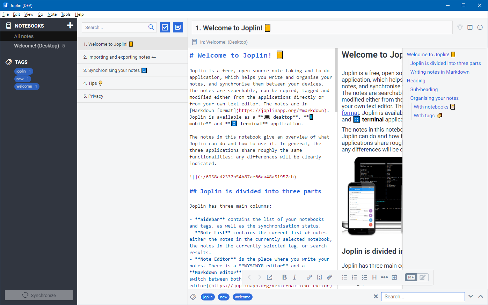

# Joplin Light Theme

_joplin-light-theme_ is a theme to adapt the UI of [Joplin's](https://joplinapp.org/) desktop application.

> **NOTE** - Tested with Joplin **v1.3.15**.

> **CAUTION** - This theme currently only works with the build-in **Light** theme.\
> Which is set via `Tools > Options > Appearance > Preferred light theme`

## Table of contents

- [Features](#features)
- [Screenshots](#screenshots)
- [Installation](#installation)
- [UI tweaks](#ui-tweaks)
- [Support](#support)
- [Changes](#changes)
- [License](#license)

## Features

This theme changes the following parts of the user interface.

- Colored tags
- No rounded corners (except Tags)
- Colored `note title`, "`breadcrumbs`" and `tag list`
  - To focus more on the actual content of the note
- Floating editor toolbar at the bottom of the content (not supported for TinyMCE)
- Improve style of column splitters (highlight while dragging)
- Local search inlined with tag list
- Floating TOC on the right hand site for rendered Markdown mode
  - Based on the idea from [here](https://discourse.joplinapp.org/t/toc-as-the-sidebar/5979/34)
- Highlight Input boxes if focused
- Change style of Synchronize button
- Change visibility of some UI elements
  - Can be reverted manually - see [UI tweaks](#ui-tweaks)
- Unified design for dialogs (same background, buttons, etc.)
  - Not finished for all views or dialogs

## Screenshots

### Main screen

### Options

### Dialogs and other views

## Installation

- Open Joplin

- Navigate to `Joplin > Preferences > Appearances`

- Click `Advanced Settings`

- Click `Custom stylesheet for rendered Markdown` and paste the content from [userstyle.css](./theme/userstyle.css)

- Click `Custom stylesheet for Joplin-wide app styles` and paste the content from [userchrome.css](./theme/userchrome.css)

- Save your changes and restart Joplin to see the changes

## UI tweaks

- Open Joplin

- Navigate to `Joplin > Preferences > Appearances`

- Click `Advanced Settings`

- Click `Custom stylesheet for rendered Markdown` to open `userstyle.css` in any text editor

- Click `Custom stylesheet for Joplin-wide app styles` to open `userchrome.css` in any text editor

- Search for `TWEAK` and change the styles as described if you want

- Save your changes and restart Joplin to see the changes

## Support

If you need help or found a bug, open an issue on [GitHub](https://github.com/benji300/joplin-light-theme/issues).

## Changes

See [CHANGELOG](./CHANGELOG.md) for details.

## License

Copyright (c) 2020 Benjamin Seifert

MIT License. See [LICENSE](./LICENSE) for more information.
